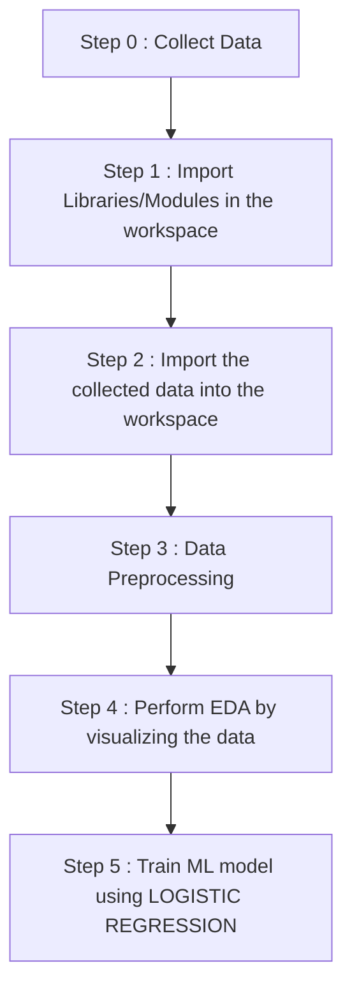

# Heart-Disease-Prediction-System-
This a ML program which predicts whether a person has a heart disease or not on the basis of the different parameters like cholestrol, age, sex etc.

Dataset Link : https://tinyurl.com/5xdhhswy

<h1 align='center'> WORKFLOW OF THE PROJECT</h1>

